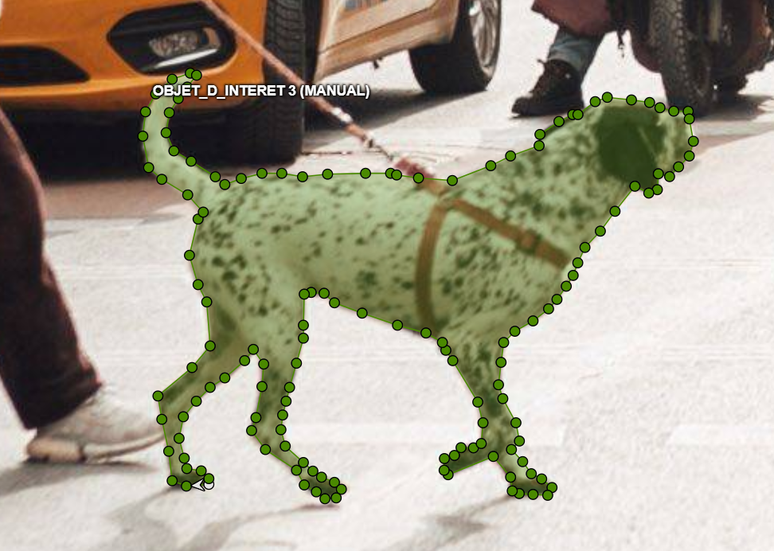
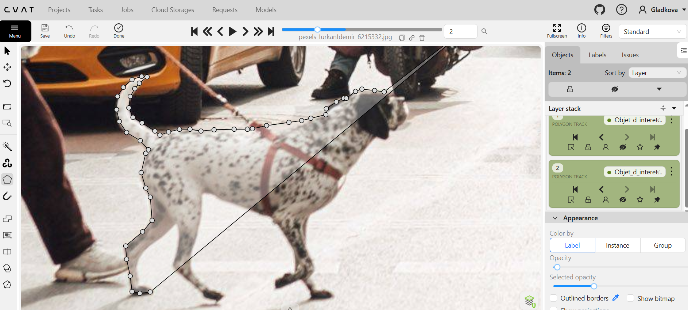

# Projet d'Annotation et de Segmentation d'Images

## Description
Ce projet personnel a été réalisé dans le cadre de ma montée en compétences sur les outils de traitement et de segmentation de données d'imagerie. L'objectif était de simuler un flux de travail professionnel, allant de la préparation des images à l'exportation structurée des annotations.

## Objectifs du projet
* **Précision :** Maîtrise de la segmentation fine par polygones.
* **Rigueur :** Respect des standards d'exportation pour une intégration directe dans des modèles d'analyse.
* **Structuration :** Organisation logique des données pour assurer leur reproductibilité et leur intégrité.

## Outils utilisés
* **Outil d'annotation :** CVAT (Computer Vision Annotation Tool).
* **Format d'exportation :** COCO (JSON).
* **Gestion des données :** Git / GitHub.

## Structure du projet
/
├── images/           # Échantillon des images traitées
├── annotations/      # Fichiers d'annotation (format .json)
└── README.md         # Documentation du projet

## Aperçu visuel

Voici une démonstration de mon travail d'annotation réalisé sur l'outil CVAT. Ces captures d'écran illustrent la précision de la segmentation par polygones et la structure des données générées.

*Illustration : Utilisation des polygones pour délimiter les zones d'intérêt avec précision.*

## Démarche technique
1. **Sélection et préparation :** Nettoyage des données et anonymisation (si applicable).
2. **Annotation :** Réalisation de la segmentation par polygones pour garantir une délimitation précise des objets.
3. **Exportation :** Génération des données au format JSON structuré, compatible avec les standards de la recherche en vision par ordinateur.

## Contact
Si vous souhaitez discuter de ce projet ou de mon profil, n'hésitez pas à me contacter via gladkowaks@gmail.com

---
*Projet réalisé en juin 2026.*
